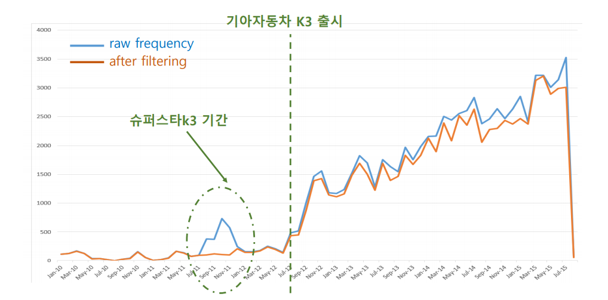

## Carblog dataset analysis

`last update`: 2019. 7. 5

이 분석 예시는 [carblog dataset][carblog dataset] 을 이용합니다. 데이터를 이용할 수 있는 파이썬 코드는 git clone 을 하면 이용할 수 있으며, 실제 데이터는 fetch 함수를 이용하여 다운로드 받아야 합니다. 자세한 사용법은 해당 데이터셋의 README 를 참고하세요.

Carblog dataset 은 네이버 블로그에서 2010. 1. 1 부터 2015. 8. 1 까지 생성된 포스트를 수집한 데이터입니다. 총 27 개의 카테고리로 구성되어 있으며, 각 카테고리는 아래의 질의어가 포함되어 있습니다.

```
category 0: A6
category 1: BMW5
category 2: BMW
category 3: K3
category 4: K5
category 5: K7
category 6: QM3
category 7: 그랜저
category 8: 벤츠E
category 9: 산타페
category 10: 소나타
category 11: 스포티지
category 12: 싼타페
category 13: 쏘나타
category 14: 쏘렌토
category 15: 아반떼
category 16: 아반테
category 17: 제네시스
category 18: 코란도C
category 19: 투싼
category 20: 티구안
category 21: 티볼리
category 22: 파사트
category 23: 폭스바겐골프
category 24: 현기차
category 25: 현대자동차
category 26: 현대차
```

하지만 질의어 검색으로 수집된 포스트 중에는 자동차와 관련없는 블로그가 포함되어 있습니다. 예를 들어 'K3' 에는 '슈퍼스타K3' 관련 포스트가 포함되어 있을 수 있습니다. 이들을 제거하지 않으면 아래처럼 시간에 따른 질의어의 buzz 분석 결과가 왜곡될 수 있습니다.



그러나 문제는 어떤 포스트가 자동차와 관련된 포스트인지 그렇지 않은지에 대한 정답 데이터가 존재하지 않는다는 점입니다. 물론 샘플을 통하여 정답데이터를 만들 수도 있고, 포스트에 달려있는 태그 정보를 바탕으로 레이블을 추정할 수도 있습니다. 하지만 일부라도 정답 데이터를 만들기 위해서는 그만큼의 데이터 구축 비용이 들어가며 (우리의 시간..), 다른 종류의 데이터에 확장 가능한 방법도 아닙니다. 이왕이면 정답 데이터에 대한 의존성을 최소화하는 "효율적인" 방법을 만들면 좋을 것입니다. 

즉 unsupervised spam filtering 을 수행해야 합니다. 이 repository 는 [carblog dataset][carblog dataset] 에서 자동차와 관련되지 않은 포스트들을 제거하는 효율적인 방법들이 포함되어 있습니다.

여러 접근법들의 코드를 순차적으로 올릴 계획입니다. 한 접근법에 대한 코드가 정리되면 위의 `last update` 에 마지막 날짜를 업데이트 하겠습니다.

`tutorials` 폴더의 `config.py` 파일에는 [carblog dataset][carblog dataset] 데이터셋의 설치 위치가 저장되어 있습니다. 각자의 환경에 맞춰 path 를 변경하신 후 이용하시기 바랍니다.

[carblog dataset]: https://github.com/lovit/carblog_dataset